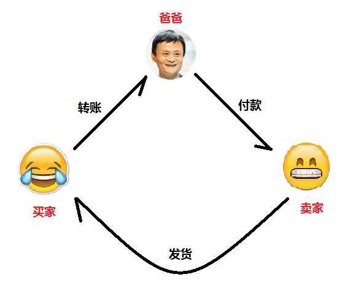

# 区块链

# 白话区块链
> 百度百科：区块链是分布式数据存储、点对点传输、共识机制、加密算法等计算机技术的新型应用模式。

区块链就像"家谱"，它在你的七大姑、八大爷哪里都有一份拷贝，而且内容完全一样，权利和义务也都是对等。

"家谱"应用包含了区块链的全部特性：
- 去中心化（"家谱"分布在各家各户）
- 不可篡改（需要达成共识才能修改"家谱"，任何家庭私自修改都是没有意义）
- 匿名性（"家谱"的修订也是大家协商认可后，大家一起更新，至于内容的更新是由谁来抄写就不重要）
- 自治性（"家谱"由家族成员功能维护，外族人无权修改别人家的"家谱"）
- 公开性（"家谱"上面记载的都是家族的光荣事迹，是完全公开的）
- 可追溯（每个人都可以通过家谱，查看自己的祖宗十八代）

# 中心化交易
目前为人们所熟知的交易方式都是中心化交易，其根基就是各交易方都相信一个共同的第三方权威。
中心化交易的过程如下图：

交易得以顺利完成，前提是买卖双方都信任支付宝。此过程存在的问题：
1. 不可靠：经营不善倒闭了又或者干脆跑路了（支付宝也许不会，但跑路的宝宝可真不少）
2. 泄露隐私：买卖双方都需要提供很多个人隐私信息（比如身份证、学历、收入等等）
3. 可篡改：支付宝拿了你的钱不认账
4. 高成本：权威并不是免费提供服务的，需要收取大量的维护及利润成本

# 去中心化交易
为了方便理解，我们来看一个简单的去中心化模型： 如果X想证明他最喜欢Y，
X在人群中大喊“我是X，我最喜欢Y！”，此时路人甲乙丙丁都听到了这些消息，所有人都在心中默默记下了“X最喜欢Y”。
当X再到人群中大喊"我是X，我最喜欢Z！"，这时路人甲乙丙丁因为有了之前的记录，就知道X在撒谎，从而拒绝记录"X最喜欢C"。

这个过程涉及到几个难题：
1. 路人甲乙丙丁凭什么相信你喊的是真实的
2. 路人甲乙丙丁凭什么给你默默记下交易
3. 如果X在不同的人群宣称最喜欢不同的人，怎么才能知道他在撒谎

# 技术难题

# 分布式存储

# 工作量证明

# 发展现状