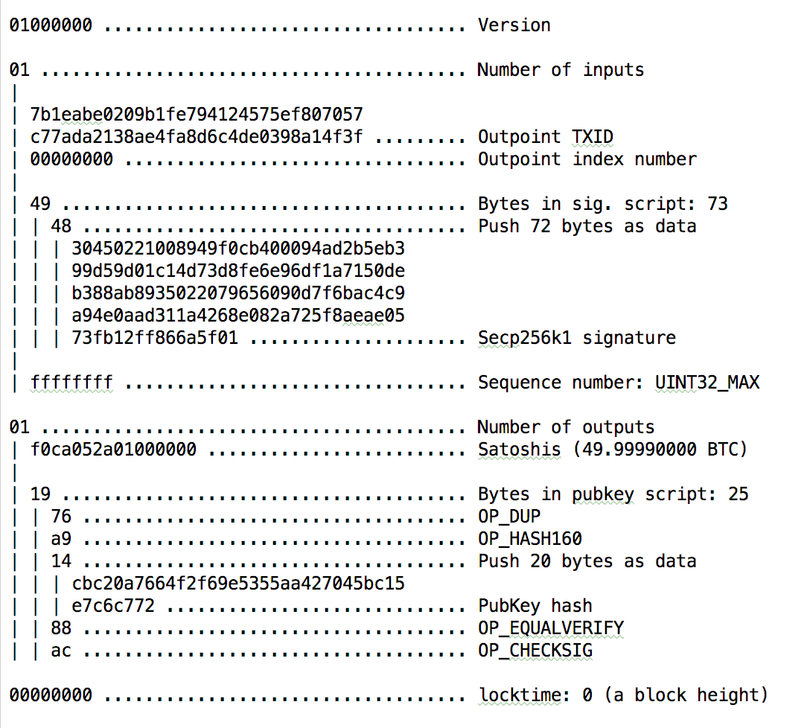

# 比特币核心架构

## 目录
- 比特币简介
- 原理概述
- 比特币网络
- 区块链
- 交易

## 比特币简介
2008年，中本聪（化名）在一篇名为《比特币：一种点对点的电子现金系统》论文中首次阐述了比特币系统。
比特币是一种**去中心化**，不需第三方机构，基于**区块链**作为支付技术的电子加密货币。
依据特定算法，通过名为**挖矿**的工作量证明机制产生。
使用P2P网络中众多节点构成的**分布式数据库**来确认并记录所有的交易行为。
基于密码学而非信任的设计来确保货币流通各个环节**安全性**。

只要网络中诚实的节点所控制的算力总和，大于合作关系的攻击者所控制的算力总和，该系统就是安全的。
首次，创造性地解决了困惑无数科学家几十年的数学难题，拜占庭将军问题（1982年由Lesile Lamport提出的）。

## 原理概述
通过以下几个核心的流程可以大致理解整个比特币网络的工作原理。
1. 用户U1（通常是通过钱包）发起一个交易TX1（从地址D1支付X个比特币到地址D2，找零Y个比特币到地址是D3），广播到网络
2. 网络上的矿工验证交易的有效性（D1是否有足够余额且拥有对D1的支配权），如果有效则放入交易池并继续广播
3. 矿工不断地调整nonce值（或者time或者交易列表即merkle_root_hash）并进行hash(pre_hash+merkle_root_hash+time+nonce)计算，以找到满足工作量证明（当前难度值nbits）的区块组合（得到挖矿奖励及交易费）
4. 矿工找到符合要求的区块头组合后，将交易池中的交易及区块头打包成一个区块并广播，矿工基于新的区块继续重复步骤3，
5. 其他节点收到新区快后，验证区块的有效性，如果有效则添加到区块链中并广播，此时该矿工就知道此轮竞争已经被淘汰，立即基于新的区块重新开始工作
6. 如果节点基于新的区块Bx挖矿时，接收到了另外一个基于前一个区块生成的新区快By，则暂时保留By，此时就产生了分叉，等到下一个区块产生时将区块链短的一个分叉淘汰。

## 比特币网络
比特币网络是运行着比特币P2P协议及其他协议（如stratum挖矿协议，gateway路由协议等）的一系列对等节点的集合。
尽管比特币网络中的节点是相互对等的，但根据所需提供的功能不同，各节点的分工和特征有所不同。
一个完整功能的节点包含四个功能：网络路由、完整区块链、矿工、钱包。

### 节点类型及分工
大致可以分为以下几种节点及对应的组成和作用：
- 核心客户端（网络路由、完整区块链、矿工、钱包）
  可用于独立地验证所有交易，而不需要外部参考，早期的比特币网络都是这种类型的节点
  
- 完整区块链节点（网络路由、完整区块链）
  可用于交易的查询，为区块链浏览器提供查询服务
  
- 独立矿工（网络路由、完整区块链、矿工）
  用于独立挖矿，而不需要外部参考
  
- 轻量（SPV）钱包（网络路由、钱包）
  可用于交易的验证，需要依赖外部包含完整区块链的节点

- 矿池协议服务器（Stratum/pool协议）
  用于管理挖矿节点，分配工作量及收益
  
- 矿池挖矿节点（矿工、Stratum/pool协议）
  用于协作挖矿

- 瘦客户端钱包（Stratum协议、钱包）
  可用于交易的验证，需要下载全部区块链但只保存用户相关的交易数据

### 扩展比特币网络
具有多种节点类型、网关及协议的扩展比特币网络如下图所示。

### 网络发现
新的网络节点启动后需要发现网络中其他比特币节点并建立连接才能参与协同工作。
节点通常对硬编码种子域名进行DNS查询得到种子节点（长期稳定运行的已知节点）的IP，进而建立连接。
当一个或多个连接后，节点将一条包含自身IP地址的`addr`消息发给相邻节点，
相邻节点再将此条`addr`消息转发给各自的相邻节点，从而新节点被多个节点接收、保证连接更稳定。
节点也可以向他的相邻节点发送`getaddr`消息，要求其返回其相邻节点的IP列表。

由于节点可以随时加入和离开，通讯路径是不可靠的。因此，节点必须持续进行两项工作：
- 在失去已有连接时发现新节点，并在其他节点启动时为其提供帮助。
- 记住它最近成功连接的节点，当重新启动后它可以迅速与先前的节点重新建立连接

### 数据交换
经过`网络发现`加入到比特币网络后，全节点需要通过发送`getblocks`消息，下载所有区块并建立区块链。
SPV节点需要通过发送`getheaders`消息，下载所有的区块头并建立区块链。
SPV节点还在相连节点上设置过滤器，用于过滤从相连节点发过来的区块和交易数据流。

### bloom过滤
由于SPV节点需要读取特定交易从而选择性地验证交易，这样就又产生了隐私风险，SPV节点对特定数据的请求可能无意中透露了钱包里的地址信息。
例如，监控网络的第三方可以跟踪某个SPV节点上的钱包所请求的全部交易信息，并且利用这些交易信息把比特币地址和钱包的用户关联起来，从而损害了用户的隐私。
Bloom过滤器不需要提供地址，只需要提供M种散列算法及长度为N的数组即可。
每种散列函数将地址散列到0~N的一个数字Mi，长度为N的数组第Mi位为1，其他为0。
这样相连节点收到交易信息后，通过同样的散列算法计算交易输出地址，如果得出的Mi与SPV节点提供的一样，则将数据发送给对方，否则不做处理。
这样做的好处就是不用暴露用户的地址，带来的影响就是可能会误匹配，别的交易输出地址也可能散列出相同的Mi，好在不会漏匹配。

## 区块链
区块链的结构类似于一个单向链表，表头指针指向上一个区块的头部hash，如下图所示。

### 区块结构
一个区块由`区块头`和`交易列表`组成，每个区块序列化之后的体积限制为`1M`。
网络节通过完整区块链中为花销交易输出验证交易的合法性。
通过Merkle根校验交易列表的有效性。
通过区块头验证工作量证明。

|名称|字节数|数据类型|描述|
-|-|-|-
|version|4|int32_t|版本号，表明本区块遵守的验证规则集合|
|previous block header hash|32|char[32]|前一个区块头的hash值|
|merkle root hash|32|char[32]|区块中所有交易数据构建的merke数根hash|
|time|4|int_32|矿工开始计算hash时的时间|
|nBits|4|int_32|当前区块的挖矿难度目标阈值，是一个256进制编码的数字|
|nonce|4|int_32|矿工计算hash时不断调整的随机数，找到一个满足条件的nonce值即表明挖矿成功|

### 挖矿与共识
比特币代码通过动态调整难度值nbits，来约束一个新的区块生成大致需要`10分钟`产生。
每打包一个区块可以得到一定数量的比特币奖励（发行比特币的过程）及可能会有的交易费用。
既然打包有利可图，就会有竞争，那到底谁有资格进行打包呢？
这里就需要一个共识机制：大家都认可的公平竞争、无法作弊的方式。
在比特币系统这种共识叫做`工作量证明`（POW），即谁能提供一份满足条件的工作量证明谁就有权记账。
具体来说，每一个区块有一个动态调整难度阈值nbits（代表所需工作量），矿工需要调整随机数（或时间戳或者交易记录），
不断地计算hash(pre_hash+merkle_root_hash+time+nonce)，直到得到的hash值小于nbits，此时完成所需的工作量，获得打包区块的权利。

注意上面的两个数字和区块的组成，由此会产生很多的疑问：
1. 为什么要10分钟产生一个区块？
区块链网络是一个大规模的P2P对等网络，每个全节点都需要同步存储整个区块链，
所以没生成一个新的区块都需要广播到整个网络。如果没有时间限制，大量新区块的快速广播很使整个网络拥堵。

2. 为什么要限制为1M？
即时是有了上面提到的10分钟一个区块的限制，如果区块很大，在整个网络广播一个非常大的文件依然会使得网络变得拥堵，甚至瘫痪。

3. 如果10分钟产生的交易超过1M了怎么办？
每一个基本的比特币交易的大小250B，1M=1024KB=1024000B=1024000/250B=4096个交易
10分钟=600秒，所以理论的最大交易速度：4096/600=6.6个交易/秒。
这个处理速度也是目前比特币被广泛质疑的问题之一，也是比特币发展可能会遇到的最致命的问题。
目前区块的大小是及时K，随着比特币逐渐被接收和广泛应用，达到这个限制只是时间问题。现在社区关于扩容问题的讨论比较火热。
也有了不少可行的解决方案，但要实现起来也是问题重重，此处不进一步展开扩展方案。

4. 如果在扩容之前达到了上限会是什么样的景象呢？
每一笔交易都是有体积（数据大小），以及可选的交易费的。那么在交易真的超过上线的时候，矿工可以选择性的将一批交易打包。
这个选择可以根据交易费、体积、到达的时间算出一个收益最大化的方案。剩余的交易参与到下一个区块的竞争。

**注意：目前比特币之[闪电网络](https://lightning.network/lightning-network-paper.pdf)已经诞生，使得小额交易可以在链下快速低成本完成，可以有效解决区块链拥堵，费用高的问题**

### 分叉与51%攻击
在世界各地分布着成千上万的矿工，如果多个矿工同时完成了工作量证明，并打包区块广播到临近的网络。
那总有一个时刻，一个节点会收到两个基于前一个区块的区块，矿工会基于先收到区块继续挖矿，但同时也会暂时保留后来收到的区块，这个时候就产生了分叉。
最后那个分支能率先产生下一个区块，则另外一个分支就会被淘汰。

这里还有另外一个问题，如果网络中存在一个算力比其他算力总和还大的矿工节点，那这个节点总是有能力将区块链分叉。
比如他可以发起一笔支付TX0（将地址D1上的N个比特币支付给D2），这个交易被一个矿工节点打包并广播到网络，
此时这个节点可以伪造另外一笔支付TX1（将地址D1上的N个比特币支付给D3），并进行工作量计算并打包新区快，但不广播。
等到D2用户确认收款并发货后，他继续基于自己伪造的交易所生成的区块继续挖矿，因为他有大量的算力，所以他总是有机会比别人更快获得打包权。
等到区块被先与其他矿工生成的时候，将区块广播出去，其他节点收到后，就会丢弃之前的区块，而基于最长的区块重新开始挖矿。
这样以来就实现了双重支付，也称之为51%攻击。

## 交易
每一个交易都包含一个或多个输入，一个或多个输入。
每一个输入或者输出都有价格。
输入价格之和与输出价格之和的余数会当做矿工的小费。

### 交易结构
|名称|字节数|数据类型|描述|
|-|-|-|-|
|version|4|int_32|版本号，目前为1，如果程序使用的是新的规则集生成的交易，版本号可能是其他|
|tx_in count|变量|compactSize uint|交易的输入数量，类型是一种内部自定的数字编码结构|
|tx_in|变量|txIn|交易的输入集合，每一个输入有其特定的数据结构|
|tx_out count|变量|compactSize uint|交易的输出数量|
|tx_out|变量|txOut|交易的输出集合，每一个输出有其特定的数据结构|
|lock_time|4|uint32_t|时间戳或者区块高度，<=500万就是区块高度，否则就是时间戳|

### 交易输入
|名称|字节数|数据类型|描述|
|-|-|-|-|
|previous_output|36|outpoint|前一个交易的输出（32字节hash+4字节索引）|
|script bytes|变量|compactSize uint|解锁脚本的长度，最大10KB|
|signature script|变量|char[]|解锁脚本|
|sequence|4|uint32_t|序列，目前是固定的ffffffff|

### 交易输出
|名称|字节数|数据类型|描述|
|-|-|-|-|
|value|8|int64_t|转移的数量，单位聪|
|pk_script bytes|变量|compactSize uint|解锁条件（一段脚本）长度|
|pk_script|变量|char[]|花销这笔比特币所需要的解锁条件（一段脚本）|

### 交易验证
交易验证主要分两部分：
1. 验证交易的输入是否是未被花费的UTXO且有足够余额
2. 验证交易提供的签名是否有效（是否有权花费此UTXO）
其中第2部分所有节点都可以独立完成，但第一部分根据节点类型不同，验证方式会有所区别

- 全节点验证
一个全节点要检查第300,000号区块中的某个交易，
它会把从该区块开始一直回溯到创世区块的300,000个区块全部都链接起来，
并建立一个完整的UTXO数据库，通过确认该UTXO是否还未被支付来证实交易的有效性。

- SPV节点验证
SPV节点会通过向相邻节点通过`merkleblock`索要从一个交易哈希值沿Merkle树上溯至区块头根哈希处的哈希序列来确认交易的存在。
然后就只需等待区块链延长，再次检索，如果依然存在，则认为交易有效。

### merkle验证
假如要验证区块结构图中交易6，SPV节点会通过向相邻节点索要（通过Merkleblock消息）包括从交易6哈希值沿Merkle树上溯至区块头根哈希处的哈希序列 (即哈希节点6, 5, 56, 78, 5678, 1234 1~8 - 称为认证路径) 来确认交易的存在性和正确性。

**在N个交易组成的区块中确认任一交易只需要计算log2(N)个字节的哈希值，非常快速高效。**