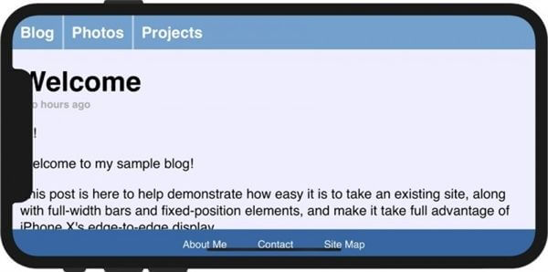

# iphoneX前端适配调研
iphoneX相对于之前的版本，主要变化就是首次实现了全面屏。由此带来的几个变化：
1. 屏幕宽高比缩小，纵向可显示区域变大
2. 顶部状态栏高度增加，包含一个居中的不透明的传感器区域，俗称`刘海`
2. 底部home键换成了虚拟区域，此区域可透视页面内容  
这些变化带来的好处就是一屏可以展现更多的内容了以及更加沉浸体验。
带来的问题就是客户端、前端会存在诸多的兼容性问题，产品开发的诸多环节都会多一份适配的工作量。

## 宽高比变化
iphoneX宽高比是9:19.5, 之前的iphone是9:16，下图是iphone8/X的屏幕尺寸对比：


竖直方向增加145pt(近20%)的显示区域，具体来说：
- 顶部statusbar增加24pt，总高达44pt（包含高度30pt的`刘海`，详见下面statusbar区域图）
- 底部tabbar占34pt（home键指示区域，此区域可以透视页面内容，但不能响应交互）
- 剩余87pt就是方正的纯内容显示区域

## 区域划分
区域主要划分成三部分：头部statusbar、安全区域、底部tabbar(home键指示区域)

- statusbar区域(此区域内容需要考虑被顶部`刘海`遮挡的问题)  


- 安全区域(苹果官方推荐的交互内容呈现区域)  


- tabbar区域(此区域内容可以透视展现，但不可做点击之类的交互)  

## 留白问题
内容渲染到安全区域，其他区域会用`body`或者`html`的`background-color`填充，如果都没有则填充白色。
这个有两种解决办法：
1. 给`body`或者`html`设置合适的背景色，防止填充默认的白色影响页面的整体性。

2. 通过`viewport-fit:cover + padding-*: safe-area-inset-*`将内容覆盖整个屏幕，并设置合适的边距（避开`刘海`和home键区域）


## 吸顶问题
因为内容被限定在了安全区域，页面的吸顶元素（`position: fixed; top: 0`）并非是屏幕的顶而是安全区域的顶。
当页面滚动时，页面内容会滚动到吸顶元素的上方且可见。


同理，吸底元素也会有同样的问题。
此问题，通过`viewport-fit:cover + padding-*: safe-area-inset-*`将内容覆盖整个屏幕，并设置合适的边距解决

## 遮挡问题
通过`viewport-fit:cover`内容延伸到全屏后，所引入的问题就是顶部`刘海`和底部home键的遮挡问题。
- 竖屏(尚可接受，因为浏览器处理了statusbar，WebView模式下面单独说)  


- 横屏(这个基本就无法接受了)  


可以通过`padding-*: safe-area-inset-*`解决遮挡问题。

```css
@supports(padding: max(0px)) {
  body {
    padding-left: max(12px, env(safe-area-inset-left));
    padding-right: max(12px, env(safe-area-inset-right));
  }
}
```
- 增加padding后竖屏如下图：  

- 增加padding后横屏如下图：  


## WebView
WebView有两种: UIWebView和WkWebView，WkWebView在iOS8中新增，用于替代性能比较差的UIWebView。
但并非所有的客户端都全部升级了，而且也不一定会升级，所以两者肯能会长期并存。  
**注意：UIWebView不支持`viewport-fit`，所以吸顶/底的问题只能通过客户端解决。**

下面是两种WebView的对比：  
  
*WkWebView可以将内容覆盖到全屏，UIWebView只能限定在安全区域。*

*PS：iOS微信6.5.3版本开始支持开发者手动切换WKWebview和UIWebview。
在微信会话列表页点击右上角“加号按钮”，选择菜单中的”添加朋友”，
在添加朋友界面的搜索框中输入字符串：“:switchweb”，再点击键盘右下角搜索按钮。
切换成功后会提示当前使用的内核是UIWebview或是WKWebview。*

## 写在最后
从前端的角度，针对iphoneX带来的问题需要做的工作如下：
- 为`html`或`body`设置一个跟主题内容区域背景接近的`background-color`
- 通过`viewport-fit:cover + padding-*: safe-area-inset-*`，增强页面的沉浸体验
- 对于吸顶/底的设计，需要处理遮挡和安全区域的限制