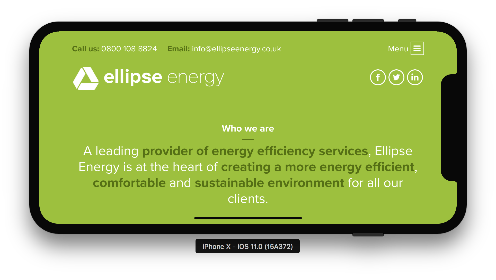

# iphoneX前端适配调研

## 尺寸变化
iphoneX宽高比是9:19.5, 之前的iphone是9:16，下图是iphone8/X的屏幕尺寸对比：

竖直方向增加145pt(近20%)的显示区域，具体来说：
- 顶部statusbar增加24pt，总高达44pt（包含高度30pt的`刘海`，详见下面statusbar区域图）
- 底部tabbar占34pt（home键区域，此区域可以透视页面内容，但不能响应交互）
- 剩余86pt就是方正的纯内容显示区域

## 区域划分
区域主要划分成三部分：头部statusbar、安全区域、底部tabbar(home键指示区域)

- statusbar区域(此区域内容需要考虑被顶部`刘海`遮挡的问题)  

- 安全区域(苹果官方推荐的交互内容呈现区域)  

- tabbar区域(此区域内容可以透视展现，但不可做点击之类的交互)  

## 刘海问题
- 竖屏(尚可接受，因为浏览器处理了statusbar)  

- 横屏(这个基本就无法接受了)

## 留白问题
内容渲染到安全区域，其他区域会用`body`或者`html`的`background-color`填充，如果都没有则填充白色。
这个有两种解决办法：
1. 给`body`或者`html`设置合适的`background-color`，防止填充默认的白色影响页面的整体性。

2. 通过`viewport-fit:cover + safe-area-inset-*`将内容覆盖整个屏幕，并设置合适的边距（避开`刘海`和home键区域）

## 吸顶问题
因为内容被限定在了安全区域，页面的吸顶元素（`position: fixed; top: 0`）并非是屏幕的顶而是安全区域的顶。
当页面滚动时，页面内容会滚动到吸顶元素的上方且可见。

同理，吸底元素也会有同样的问题。
此问题，通过`viewport-fit:cover + safe-area-inset-*`将内容覆盖整个屏幕，并设置合适的边距解决

- 竖屏铺满全屏后如下图：  

- 横屏屏铺满全屏后如下图：  

## webview
webview有两种: UIWebview和WkWebview，WkWebview在iOS8中新增，用于替代性能比较差的UIWebview。
但并非所有的客户端都全部升级了，而且也不一定会升级，所以两者肯能会长期并存。  
**注意：UIWebview不支持`viewport-fit`，所以吸顶/底的问题只能通过客户端解决，前端无能为力。**
下面是两种webview的对比：  
