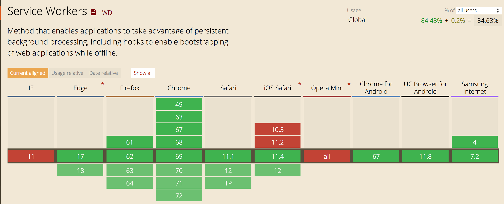
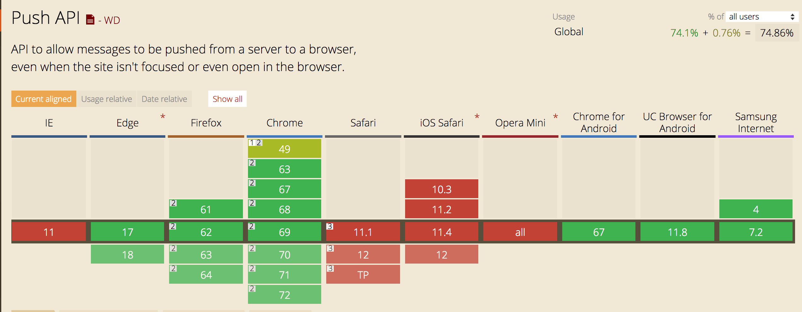

# PWA技术概述

## 简介
Progressive Web App, 简称 PWA，是由`谷歌`提出推动，旨在是提升 Web App 体验的一系列新方法/API，能给用户接近原生应用的体验。

PWA 的主要特点：
- **可靠** - 在不稳定的网络环境下甚至断网的情况也能加载、呈现
- **快速** - 快速加载，快速、平滑的动画响应用户的操作
- **粘性** - 具有沉浸式的用户体验，可以安装到桌面，全屏展示，离线推送消息

涉及到的新方法/API如下：
- [Web App Manifest](https://developer.mozilla.org/en-US/docs/Web/Manifest)
- [Service Worker API](https://developer.mozilla.org/en-US/docs/Web/API/Service_Worker_API)
- [Push API](https://developer.mozilla.org/en-US/docs/Web/API/Push_API)

## Web App Manifest
- 引入`manifest`文件
```html
  <link rel="manifest" href="/manifest.json">
```

- `manifest`文件配置
```javascript
  // 方便写注释，定义成一个js对象
  var manifest = {
    "scope": "/", // 配置文件作用域
    "background_color": "blue", // 显示在状态栏
    "theme_color": "red",
    "name": "完整的应用名称",
    "short_name": "应用名简称",
    "description": "应用描述，类似于meta中的description",
    
    "start_url": "",
    "display": "standalone", // standalone || fullscreen || minimal-ui || browser
    "orientation": "", // any || natural || landscape/portrait-primary/secondary
    "icons": [
      {
          "src": "icon/lowres.webp",
          "sizes": "48x48",
          "type": "image/webp"
        },
        {
          "src": "icon/hd_logo.ico",
          "sizes": "72x72"
        },
        {
          "src": "icon/hd_logo.svg",
          "sizes": "96x96 144x144 192x192 256x256 512x512"
        }
    ],
    
    "prefer_related_applications": true,
    "related_applications": [
      {
          "platform": "play",
          "url": "https://play.google.com/store/apps/details?id=com.example.app1",
          "id": "com.example.app1"
        }, {
          "platform": "itunes",
          "url": "https://itunes.apple.com/app/example-app1/id123456789"
        }
    ], // 获取对应原生应用的方式
    
    "lang": "",
    "dir": "", // ltr || rtl || auto
  }
```

## Service Worker
Service worker是一个注册在指定源和路径下的事件驱动的工作线程。
它采用JavaScript控制关联的页面，可以拦截并修改资源请求。
Service worker作为工作线程运行，不能访问`DOM`，只能由`HTTPS`承载。

### 生命周期
- **注册** - 页面适当位置进行注册，避免影响业务代码的加载/执行
```javascript
  window.addEventListener('load', function() {
    if ('serviceWorker' in navigator) {
        navigator.serviceWorker.register('./sw.js', {scope: './'});
      }
  });
```
- **下载** - 用户首次访问service worker控制的网站或页面时，service worker会立刻被下载，之后至少每24小时它会被下载一次
- **安装** - 下载完成后立即进行安装
- **激活** - 首次安装立即激活，之后的的安装需要等待旧的worker没有页面使用的时候，才会停止旧的激活新的，也可以通过接口直接接活
- **停止** - 页面关闭后会停止，再次打开或者有消息推送的时候会被激活

### 作用
- 后台数据同步
- 资源预加载
- 后台服务钩子
- 数据多页面同步
- 响应来自其它源的资源请求
- 自定义模板用于特定URL模式
- 在客户端进行CoffeeScript，LESS，CJS/AMD等模块编译和依赖管理（用于开发目的）

接口层提供了`fetch`钩子函数及`cache`相关的存、取接口，可以自行设计缓存策略。
google开源了强大的框架[workbox](https://github.com/GoogleChrome/workbox)，提供了非常易用的接口调用及强大的可扩展性，可以免去大量的封装工作，只需要专注于策略的编写。

*PS: 这里有个坑，不要使用默认的实现，谷歌把整套代码部署在了自己的CDN上按需加载，这会泄露业务的统计数据，更重要的是大多数国内用户会被墙*

## Push Notification
### 工作原理
从顶层视角来看，主要分为三个步骤：
1. 客户端代码引导用户订阅消息推送
2. 业务服务端触发消息推送的事件到用户
3. service worker 接收推送事件，并通过桌面通知方式通知用户

但为了防止滥用、性能及安全性问题，实际的过程却并未以上所述的那么简单、明了，下面逐步详解相关的技术细节。

#### 第一步，客户端
客户端代码引导用户定于消息推送，在这之前需要生成`application server keys`，即一个公/私钥对，后面会讲。
然后调用`PushSubscription`接口，这个过程可以得到一个用户相关的订阅对象`subscription`，这个对象包含了该用户设备相关的信息。
然后把这个对象上传到业务服务器，业务服务器将此信息与用户建立对应关系（后续有用户相关消息需要推送的时候需要用到）

这个过程大致如下：


`subscription`对象结构如下：
```json
  {
    "endpoint":"https://fcm.googleapis.com/fcm/send/drcTF_vByoc:APA91bFd7EJfEsD_ebeWVInT_za6mL9QupzNsubnmjjF1-aw4ZSQJfq-1R42h0pjhL4OHe9v39khKHGEFZJdiWVPqSn6YFqQ2DEOBaUnOlLxKNCUz7SBa2ctJ85tKp0S7l3kQuFC2L5J",
    "expirationTime":null,
    "keys":{
      "p256dh":"BFVa344lqG-_d9kAl6ULKuixEngrG35nqyVM3JIoXFFyPmMVMNcDX-Yj21zvDYA4FIVJJ7xYfC6YY39nouQMNbs",
      "auth":"3XZotj1VMsfAHFMgE-BxtQ"
     }
   }
```

#### 第二步，推送消息
当业务有消息需要通知用户的时候，需要调用一个`push service`的`API`来实现。
这里我们需要理解几个问题：
1. **第一个问题：** 什么是`push service`，又是谁提供`push service`服务？    
`push service`就是接受网络请求，并把请求推送到合适的浏览器，简单的说就是一个消息转发服务。
浏览器可以使用任何的`push service`，由浏览器自行决定，不受业务控制，但没关系，因为每一个`push service`提供完全相同的`API`。
上面讲到，用户订阅成功后会得到一个`subscription`对象，此对象中的`endpoint`就是此次订阅对应的`API`地址，业务后端只需要调用这个地址的接口即可。
至于谁来提供`push service`，因为是标准化的协议，所以理论上谁都可以提供，如何实现可以参考[web push protocol](https://tools.ietf.org/html/draft-ietf-webpush-protocol-12)

2. **第二个问题：** `API`是什么样的？    
接口调用要求传递特定的`header`头部信息，及相关的二进制数据体，涉及到一系列的加密算法，实现相对比较繁琐。
好在主流的后端语言都有开源社区实现了底层的封装，业务侧可以直接基于别人的封装做更高层次的接口调用，协议细节参考[web push protocol](https://tools.ietf.org/html/draft-ietf-webpush-protocol-12)。
- [nodejs](https://github.com/web-push-libs/web-push)
- [php](https://github.com/web-push-libs/web-push-php)
- [go](https://github.com/SherClockHolmes/webpush-go)
- ...

3. **第三个问题：** `API`能做什么？    
`API`是提供业务推送消息到用户的途径，并保证数据传输的安全。因为`push service`可以是任何人提供，所以数据必须加密且可以做有效性校验。


#### 浏览器响应推送事件
`service worker`通过监听`push`事件，得到消息体，并可以通过桌面通知`notification`通知用户


### 完整的过程


## 浏览器支持现状
- Web App Manifest

- service worker API

- Push API
